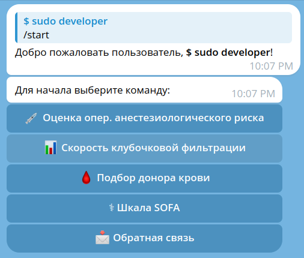

# Телеграм бот на фреймворке aiogram 3.10  интеграцией базы данных PostgreSQL через библиотеку asyncpg_lite

### Описание.

#### Информация о боте
 
 - Oбщемедицинский бот, адрес - https://t.me/generalmedical_bot
 - Для работы с ботом нажмите команду /start, после этого выберите одно из четырёх приложений.
  
#### Телеграм бот содержит 4 приложения:
 - Оценка (классификация) операционно-анестезиологический риска.
 - Cкорость клубочковой фильтрации.
 - Подбор донора крови.
 - Шкала SOFA.
 - Обратная связь

  

  - Для быстрого доступа к основным приложениям в боте доступно меню:

  

  - После завершения работы одного из приложений предлагает выбор действий:
  
  

  - На некорректное сообщение от пользователя выводит:
  
  

#### Стэк
- Проект на 90% покрыт тестами с использованием unittest.

- Python 3.12, aiogram==3.10, asyncpg, asyncpg-lite, psycopg2-binary, python-dotenv, SQLAlchemy,
  PostgreSQL, unittest, coverage, docker

